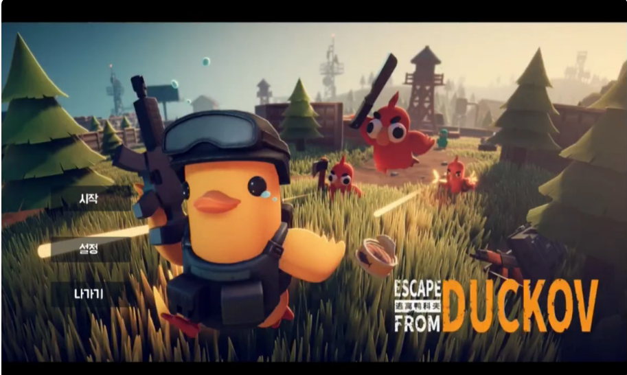

# DucKov

### C++ · DirectX 11 Custom Engine · 개인 프로젝트

**《Escape from Duckov》를 모작한 탑다운 루터 슈터**

**[▶ 플레이 영상 보기](https://www.youtube.com/watch?v=GqYtCVZie5w)**

 

---

## 프로젝트 소개

필드를 탐색하며 적과 전투하고, 획득한 아이템을 인벤토리에 구성해 장비를 강화한 뒤 보스와 다음 지역에 도전하는 탑다운 액션 게임입니다. 자체 제작한 DirectX 11 엔진 위에서 게임플레이와 렌더링, UI, 개발용 편집 도구를 구현했습니다.

## 개발 정보

| 항목 | 내용 |
| --- | --- |
| 개발 기간 | 2026.03.16 ~ 2026.06.26 |
| 개발 형태 | 개인 프로젝트 · 1인 개발 |
| 장르 | 탑다운 루터 슈터 · 액션 RPG |
| 개발 환경 | Windows 10/11 · Visual Studio 2022 · MSVC v143 |
| 솔루션 | `Framework.sln` |

## 적용 기술

| 분류 | 적용 기술 |
| --- | --- |
| Language | C++17 · C++20 |
| Graphics | DirectX 11 · HLSL · Effects11 · DirectXTK |
| Rendering | Deferred Rendering · Shadow Map · Bloom · Model Instancing |
| Engine | Prototype Pattern · Component 구조 · Render Group · Resource Manager |
| Animation | Skeletal Animation · Animation Blending · Bone Socket |
| Gameplay | FSM · Mouse Picking · AABB / OBB / Sphere Collision · Particle System |
| AI | Navigation Mesh · A* Pathfinding · 일반 몬스터·보스 상태 제어 |
| UI | 인벤토리 · 장비 슬롯 · HUD · 상호작용 UI · 스테이지 UI |
| Tools | Dear ImGui · Map Editor · NavMesh Editor · Terrain Splat Painting |
| Data | Assimp · nlohmann/json · Win32 File I/O |

## 주요 콘텐츠

- 마우스 기반 탑다운 이동과 조준·사격
- 일반 몬스터 전투와 2페이즈 보스전
- 아이템 획득, 인벤토리 정리, 무기·방어구 장착
- 필드 탐색과 포털을 통한 스테이지 진행
- 혈흔·연기·불꽃·총알 궤적 파티클
- 맵·NavMesh·지형·수목 배치를 위한 개발 도구

## 빌드 환경

1. Visual Studio 2022에서 `Framework.sln`을 엽니다.
2. 플랫폼을 `x64`, 구성을 `Debug` 또는 `Release`로 선택합니다.
3. `Engine`을 먼저 빌드한 뒤 `Client`를 빌드합니다.

> 포트폴리오용 소스 코드 저장소이며, 일부 게임 리소스는 용량 및 라이선스 문제로 포함하지 않았습니다.

---

**Developed by 김민수**

