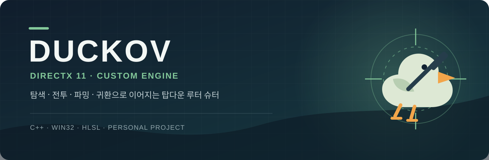

<div align="center">



# DucKov

### C++ · DirectX 11 Custom Engine · 개인 프로젝트

**《Escape from Duckov》의 탐색·전투·파밍 흐름을 자체 엔진으로 구현한 탑다운 루터 슈터 모작**

<br>


</div>

---

## 프로젝트 정보

| 항목 | 내용 |
| --- | --- |
| 개발 기간 | 2026.03.16 ~ 2026.06.26 |
| 개발 형태 | 개인 프로젝트 · 1인 개발 |
| 장르 | 탑다운 루터 슈터 · 액션 RPG |
| 개발 환경 | Windows 10/11 · Visual Studio 2022 · MSVC v143 |
| 핵심 기술 | C++ · Win32 API · DirectX 11 · HLSL |
| 외부 라이브러리 | Assimp · DirectXTK · Effects11 · Dear ImGui · nlohmann/json |

## 프로젝트 소개

DucKov는 필드를 탐색하며 적과 전투하고, 획득한 장비를 인벤토리에 구성한 뒤 보스 전투와 다음 지역으로 진행하는 게임입니다. 게임플레이 기능뿐 아니라 렌더링, 애니메이션, 충돌, 내비게이션, 파티클과 개발용 편집 도구까지 자체 DirectX 11 엔진 위에서 구현했습니다.


## 주요 구현

### 1. 자체 DirectX 11 엔진과 게임 오브젝트 구조

- Prototype을 등록한 뒤 필요한 시점에 복제하는 구조로 게임 오브젝트와 컴포넌트 생성을 통일했습니다.
- `GameInstance`를 중심으로 Object, Level, Renderer, Resource, Collision, UI 등의 매니저를 연결했습니다.
- Transform, Shader, Model, Collider, Navigation을 컴포넌트로 분리해 플레이어·몬스터·맵 오브젝트가 필요한 기능만 조합하도록 구성했습니다.
- Update 단계를 `Priority_Update → Update → Late_Update`로 나누고, 렌더 그룹별로 객체를 수집해 그리는 흐름을 구성했습니다.

관련 코드: [`Engine/Private/GameInstance.cpp`](Engine/Private/GameInstance.cpp) · [`Engine/Private/Object_Manager.cpp`](Engine/Private/Object_Manager.cpp) · [`Engine/Private/Renderer.cpp`](Engine/Private/Renderer.cpp)

### 2. FSM 기반 플레이어·몬스터 전투

- 플레이어의 대기, 이동, 달리기, 구르기, 피격과 무기 사용을 상태별 클래스로 분리했습니다.
- 마우스 피킹 위치를 바라보는 탑다운 조작과 카메라 추적, 총기 교체, 발사체와 레이저 트레일을 연결했습니다.
- 일반 몬스터와 보스는 독립 FSM으로 구성하고, 보스는 체력과 전투 진행에 따라 2페이즈 패턴으로 전환되도록 만들었습니다.
- 애니메이션 상태와 무기 소켓, 공격 판정, 상태 UI가 같은 FSM 값을 기준으로 동작하도록 맞췄습니다.

관련 코드: [`Client/Private/Player_FSM.cpp`](Client/Private/Player_FSM.cpp) · [`Client/Private/LittleMonsterFSM.cpp`](Client/Private/LittleMonsterFSM.cpp) · [`Client/Private/BossMonsterFSM.cpp`](Client/Private/BossMonsterFSM.cpp)

### 3. Navigation Mesh와 A* 경로 탐색

- 삼각형 Cell의 이웃 관계를 구성하고 현재 위치가 속한 Cell을 기준으로 지형 높이와 이동 가능 여부를 판정했습니다.
- 시작 Cell과 목표 Cell 사이를 A*로 탐색해 몬스터가 플레이어까지 이동할 경유점을 생성했습니다.
- 직선 이동 가능 여부를 추가로 검사해 불필요한 경유점을 줄이고, 몬스터 FSM의 추적·공격 상태와 연결했습니다.
- NavMesh를 직접 배치하고 저장할 수 있는 ImGui 기반 편집 도구를 함께 구현했습니다.

관련 코드: [`Engine/Private/Navigation.cpp`](Engine/Private/Navigation.cpp) · [`Engine/Private/Cell.cpp`](Engine/Private/Cell.cpp) · [`Client/Private/NavMeshEditor.cpp`](Client/Private/NavMeshEditor.cpp)

### 4. 인벤토리·장비·게임 UI 연동

- 가방, 총기, 방어구, 헬멧 슬롯을 구분하고 아이템 종류에 맞는 슬롯에만 장착되도록 처리했습니다.
- 드래그 앤 드롭 중 슬롯 교체와 복귀를 관리하고, 장착 결과를 플레이어 무기·방어구 모델과 HUD 아이콘에 즉시 반영했습니다.
- 인벤토리 개폐 시 슬라이드와 알파 애니메이션을 적용하고, 아이템과 슬롯 상태를 저장·불러오기 데이터로 변환했습니다.
- 몬스터 드롭 아이템, 상호작용 안내, 체력·보스 상태와 스테이지 진행 UI를 게임 흐름에 연결했습니다.

관련 코드: [`Client/Private/InvenUI.cpp`](Client/Private/InvenUI.cpp) · [`Client/Private/InteractBox.cpp`](Client/Private/InteractBox.cpp) · [`Client/Private/MainUI.cpp`](Client/Private/MainUI.cpp)

### 5. Deferred Rendering·Shadow Map·Bloom

- Diffuse, Normal, Depth, Shade, Specular, Emission을 별도 Render Target에 기록한 뒤 조명 결과를 합성하는 Deferred Rendering 흐름을 구성했습니다.
- Light View/Projection 기준의 Shadow Depth를 생성하고 캐릭터·몬스터·지형 오브젝트의 Shadow Pass를 분리했습니다.
- 밝기 Threshold 추출 후 1/2, 1/4, 1/8 해상도로 Down Sample하고, 가로·세로 Blur와 Up Sample을 거쳐 Bloom을 합성했습니다.
- Bullet Trail, 피격 효과, 혈흔·연기·불꽃 파티클을 렌더 파이프라인과 연결했습니다.

관련 코드: [`Engine/Private/Renderer.cpp`](Engine/Private/Renderer.cpp) · [`Engine/Private/RenderTarget.cpp`](Engine/Private/RenderTarget.cpp) · [`Engine/Private/Shadow.cpp`](Engine/Private/Shadow.cpp)

### 6. 지형 제작 도구와 인스턴싱

- 마우스 Picking 위치를 Terrain Local 좌표로 변환하고 Grass, Mud, Road 채널을 브러시로 칠하는 Splat Map 도구를 구현했습니다.
- 편집한 Splat Texture를 PNG로 저장·로드해 제작 결과가 실행 시 그대로 복원되도록 했습니다.
- 나무는 하나의 모델을 Instance Buffer로 관리하고 `DrawIndexedInstanced`로 렌더링했습니다.
- 배치 위치·크기·회전을 JSON으로 저장하고, 브러시 방식으로 다수의 나무를 추가·삭제할 수 있게 구성했습니다.

관련 코드: [`Client/Private/Terrain.cpp`](Client/Private/Terrain.cpp) · [`Client/Private/Tree.cpp`](Client/Private/Tree.cpp) · [`Engine/Private/InstanceModel.cpp`](Engine/Private/InstanceModel.cpp)

## 프로젝트 구조

```text
DucKov/
├─ Engine/              # DirectX 11 기반 공용 엔진
│  ├─ Public/           # 엔진 인터페이스와 컴포넌트
│  └─ Private/          # 렌더링·리소스·충돌·내비게이션 구현
├─ Client/              # DucKov 게임 로직
│  ├─ Public/           # 플레이어·몬스터·UI·레벨 선언
│  └─ Private/          # FSM·전투·인벤토리·게임플레이 구현
├─ EngineSDK/           # Client가 참조하는 엔진 헤더와 라이브러리
├─ AssimpImporter/      # 모델·애니메이션 변환 도구
└─ Framework.sln        # Visual Studio 솔루션
```

## 빌드 환경

1. Windows에서 Visual Studio 2022로 `Framework.sln`을 엽니다.
2. 플랫폼을 `x64`, 구성을 `Debug` 또는 `Release`로 선택합니다.
3. `Engine`을 먼저 빌드한 뒤 `Client`를 빌드합니다.

> 이 저장소는 포트폴리오용 소스 코드 저장소입니다. 게임 실행에 필요한 일부 원본 리소스는 용량 및 라이선스 문제로 포함하지 않았습니다.

---

<div align="center">

**Developed by 김민수**

</div>
